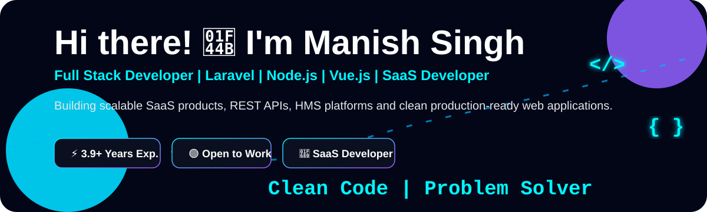
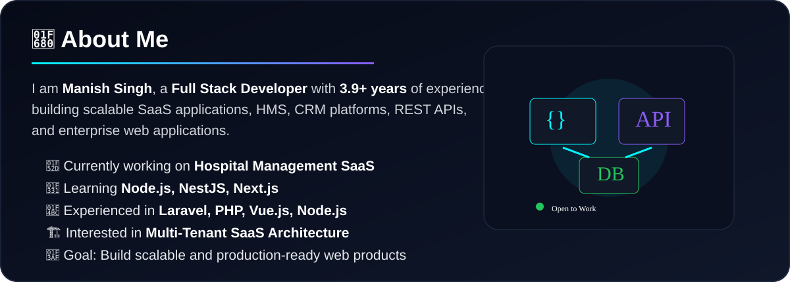
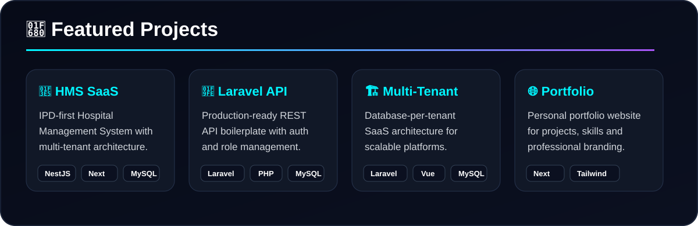

 

---

---

---

## 📊 GitHub Stats

  

---

## 📈 Activity Graph

---

---

## 🐍 Contribution Snake

---

---

## 🔎 SEO Keywords

`Manish Singh` `Manish Kumar Singh` `Raunakmanish` `Full Stack Developer India` `Laravel Developer India` `PHP Developer India` `Node.js Developer` `NestJS Developer` `Vue.js Developer` `React.js Developer` `Next.js Developer` `Nuxt.js Developer` `SaaS Developer` `Hospital Management System Developer` `HMS SaaS Developer` `REST API Developer` `MySQL Developer` `Multi Tenant SaaS Developer` `Docker Developer` `JWT Authentication` `RBAC Developer`

---

